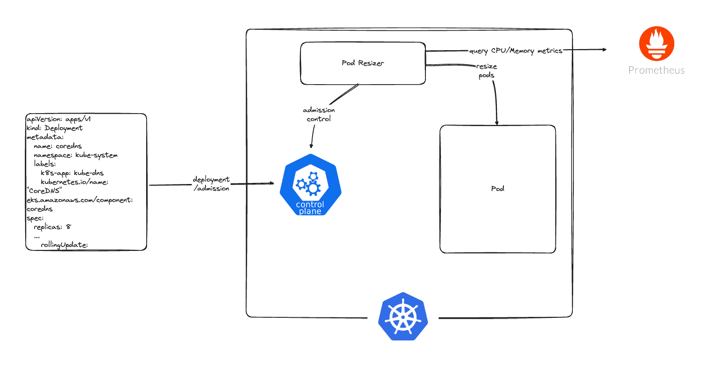

Pod-resizer
=======================================================

**What is it?**

This is a kubernetes admission controller webhook that would resize pods resources with CPU/Memory metrics from prometheus.

**How does it help?**

When developers/SREs provision an application in a kubernetes container they mostly use a generic request and limit ranges on them hoping for the best. 
This admission webhook will allow you to automatically override the resources set and set the current mid-to-long term CPU and Memory usage metrics for the pods.

## Architecture

## How to use it?
Pod-resizer uses an opt-in process to override pod resources. This is done by using a custom annotation in the main controller(`Deployment`/`Statefulset`/`Daemonset`).
To enable pod resizing for your controller please add the following annotation in the template spec. </n>
Set `app.traderepublic.com/set-resources` this annotation key and value to `True`. </n>

## License
The MIT License (MIT) - see [`LICENSE.md`](./LICENSE.md) for more details

